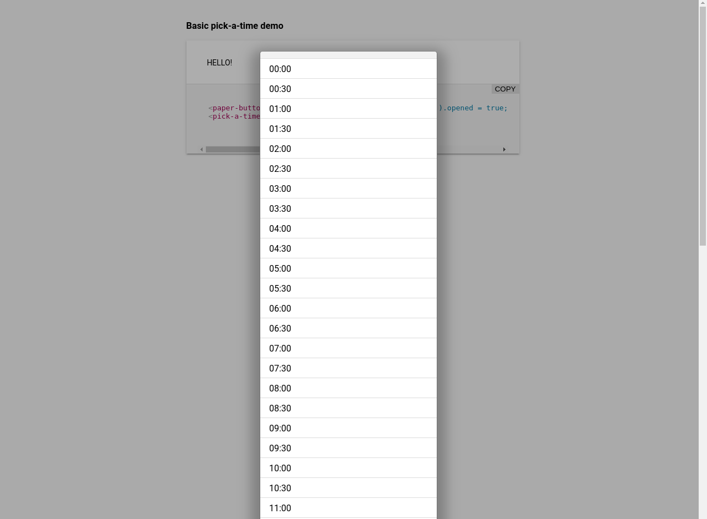

[](https://www.webcomponents.org/element/faan11/pick-a-time)


# \<pick-a-time\>



Whenever you need to open this calendar relaying on the click event, you have to use the following methods:
 event.preventDefault(); event.stopPropagation()


## Install the Polymer-CLI

First, make sure you have the [Polymer CLI](https://www.npmjs.com/package/polymer-cli) installed. Then run `polymer serve` to serve your element locally.

## Viewing Your Element

```
$ polymer serve
```

## Running Tests

```
$ polymer test
```

Your application is already set up to be tested via [web-component-tester](https://github.com/Polymer/web-component-tester). Run `polymer test` to run your application's test suite locally.
